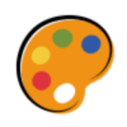

  

  <h3 align="center">Doodle Board 🎨</h3>

  

      Unleash Your Creativity, One Stroke at a Time!
     
    <a href="https://doodle-board.netlify.app/"><strong>Go to App »</strong></a>
     
     
    <a href="https://github.com/prerana1821/doodleboard/pulls">Raise a PR</a>
    ·
    <a href="https://github.com/prerana1821/doodleboard/issues">Report Bug</a>
    ·
    <a href="https://github.com/prerana1821/doodleboard/issues">Request Feature</a>
  

Doodle Board is an interactive drawing platform built entirely with JavaScript. This project offers a versatile set of tools and features for users to express their creativity. Whether you want to sketch freely, annotate images, or add shapes and text, Doodle Board has got you covered. Unleash your creativity with Doodle Board! 🚀🎨 Express yourself freely and bring your ideas to life!

# Demo

[View Demo](https://drive.google.com/file/d/1Pe_zr2gR4ZJ06MNxqXSKAwzGM7AOM8h1/view?usp=sharing)

## Key Features

- **Pencil & Marker**: Allows freehand drawing with adjustable size, color, edges, and patterns (solid, dashed, dotted).
- **Eraser**: Enables erasing drawn content with an adjustable size.
- **Shapes**: Offers various shapes like square, circle, diamond, rectangle, and triangle for drawing.
- **Text**: Allows users to add text with options for size and font family, along with draggable, resizable, and delete functionalities.
- **Sticky Note**: Provides colorful sticky notes for annotations, draggable and resizable, with options to minimize or remove.
- **Upload**: Enables users to upload images for annotation, which are draggable and resizable, with options to minimize or remove.
- **Background Color**: Offers options to change the background color of the canvas.
- **Reset**: Provides functionality to reset the canvas quickly.
- **Undo/Redo**: Supports undo and redo actions for drawing.
- **Download**: Allows users to download the content image.

## How to use?

1. **Pencil & Marker**

   - Click on the Pencil or Marker tool.
   - Adjust size, color, edges, and patterns using the provided options.

2. **Eraser**

   - Select the Eraser tool.
   - Adjust the eraser size.

3. **Shapes**

   - Choose a shape from the icons.
   - Draw the selected shape on the canvas.

4. **Text**

   - Click on the Text tool.
   - Adjust text size and font family.
   - Click on the canvas to add text.

5. **Sticky Note**

   - Click on the Sticky Note icon.
   - Choose a color.
   - Click on the canvas to add a sticky note.

6. **Upload**

   - Click on the Upload icon.
   - Choose an image file to upload.

7. **Background Color**

   - Click on the Background Color icon.
   - Choose a color for the canvas background.

8. **Reset**

   - Click on the Reset icon to clear the canvas.

9. **Undo/Redo**

   - Use the Undo and Redo buttons to navigate through drawing actions.

10. **Download**

- Click on the Download icon to save the canvas as an image.

## TODO Features

- [x] marker ( change width, colors, 3 types of style, 2 types edges ) - DONE
- [x] highlighter ( change width, colors, 3 types of style, 2 types edges ) - DONE
- [x] Write text (with markdown) - DONE
- [ ] Add markdown on sticky notes
- [x] Create shapes: square, circle, rectangle, diamond, triangle, downward pointing triangle, rounded rectangle (filled & outline) - DONE
- [ ] Straight line & Arrow
- [ ] panning tool
- [ ] stamp feature
- [ ] add comment features
- [ ] add layers
- [x] change canvas color - DONE
- [ ] add typescript
- [x] change the mouse type based on pencil, eraser or marker - DONE

## Installation

No installation is required. Simply open the project in a web browser to start drawing!

## Contributing

I welcome contributions from the community to improve Skillful CV. If you find a bug or have an idea for a new feature, feel free to create an issue or submit a pull request.

## License

This project is licensed under the MIT License. See the LICENSE file for more details.

## Acknowledgments

I extend my gratitude to the developers of the open-source libraries used in this project, as they have contributed significantly to its success.

## Contact

If you have any questions or suggestions, please feel free to reach out to us at prerananw1@gmail.com.
